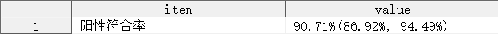
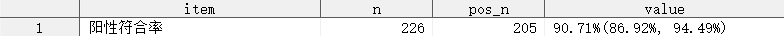
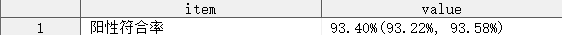
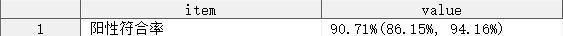
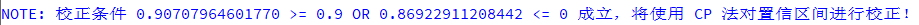
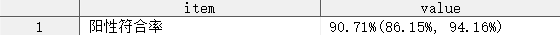
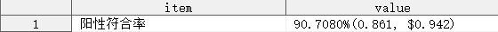
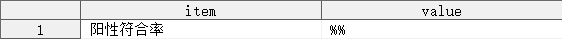

## 简介

计算构成比（率）及其置信区间的宏程序。

## 语法

### 必选参数

- [INDATA](#indata)
- [COND_POS](#cond_pos)
- [COND_NEG](#cond_neg)
- [STAT_NOTE](#stat_note)
- [OUTDATA](#outdata)

### 可选参数

- [WEIGHT](#weight)
- [ADJUST_METHOD](#adjust_method)
- [ADJUST_THRESHOLD](#adjust_threshold)
- [ALPHA](#alpha)
- [FORMAT](#format)
- [PLACEHOLDER](#placeholder)

### 调试参数

- [DEL_TEMP_DATA](#del_temp_data)

## 参数说明

### INDATA

**Syntax** : <_libname._>_dataset_(_dataset-options_)

指定用于定性分析的数据集，可包含数据集选项

_libname_: 数据集所在的逻辑库名称

_dataset_: 数据集名称

_dataset-options_: 数据集选项，兼容 SAS 系统支持的所有数据集选项

**Example** :

```sas
- INDATA = ADSL
- INDATA = SHKY.ADSL
- INDATA = SHKY.ADSL(where = (FAS = "Y"))
```

---

### COND_POS

**Syntax** : _positive-condition_

指定二项分布中试验“成功”的条件。

_`positive-condition`_ 表示二项分布中代表试验“成功”的条件。例如：计算阳性符合率时，试验“成功”的条件是考核试剂和对比试剂检测结果均为阳性，则可以指定 `cond_pos = %str(TSTP = "阳性" and TSTC = "阳性")`，其中变量 `TSTP` 表示考核试剂检测结果，`TSTC` 表示对比试剂检测结果，此时符合 _`positive-condition`_ 条件的观测数量为“真阳性”的频数。

**Caution** :

1. 参数 `COND_POS` 指定的参数实际上被视为 WHERE 条件表达式，因此必须是合法的 SAS 条件表达式；
2. 参数 `COND_POS` 指定的参数可以包含 `IN` 操作符，但不能使用 `#` 操作符

**Example** :

```sas
COND_POS = %str(TSTP = "阳性" and TSTC = "阳性")
COND_POS = %str(TSTP = TSTC)
```

---

### COND_NEG

**Syntax** : _negative-condition_

指定二项分布中试验“失败”的条件。

_`negative-condition`_ 表示二项分布中代表试验“失败”的条件。例如：计算阳性符合率时，试验“失败”的条件是考核试剂检测结果为阴性，而对比试剂检测结果为阳性，则可以指定 `cond_pos = %str(TSTP = "阴性" and TSTC = "阳性")`，其中变量 `TSTP` 表示考核试剂检测结果，`TSTC` 表示对比试剂检测结果，此时符合 _`negative-condition`_ 条件的观测数量为“假阴性”的频数。

**Caution** :

1. 参数 `COND_NEG` 指定的参数实际上被视为 WHERE 条件表达式，因此必须是合法的 SAS 条件表达式；
2. 参数 `COND_NEG` 指定的参数可以包含 `IN` 操作符，但不能使用 `#` 操作符

**Example** :

```sas
COND_POS = %str(TSTP = "阴性" and TSTC = "阳性")
COND_POS = %str(TSTP ^= TSTC)
```

---

### STAT_NOTE

**Syntax** : _string_(_s_)

指定计算的构成比（率）的展示名称。

`STAT_NOTE` 指定的展示名称将输出至参数 `OUTDATA` 指定的数据集中。

**Example** :

```sas
STAT_NOTE = %str(阳性符合率)
```

---

### OUTDATA

**Syntax** : <_libname._>_dataset_(_dataset-options_)

指定统计结果输出的数据集，可包含数据集选项，用法同参数 [INDATA](#indata)。

输出数据集有 11 个变量，具体如下：

| 变量名   | 含义                     |
| -------- | ------------------------ |
| ITEM     | 统计量名称               |
| N        | “成功”和“失败”的总频数   |
| POS_N    | “成功”的频数             |
| NEG_N    | “失败”的频数             |
| RATE     | 构成比（率）             |
| RATE_FMT | RATE 的字符形式          |
| LCLM     | 置信区间下限             |
| LCLM_FMT | LCLM 的字符形式          |
| UCLM     | 置信区间上限             |
| UCLM_FMT | UCLM 的字符形式          |
| VALUE    | 构成比（率）及其置信区间 |

其中，变量 `ITEM` 和 `VALUE` 默认输出到 `OUTDATA` 指定的数据集中，其余变量默认隐藏。

**Tips** : 如需显示隐藏的变量，可使用数据集选项实现，例如：`OUTDATA = T1(KEEP = ITEM N POS_N NEG_N VALUE)`

**Example** :

```sas
OUTDATA = T1
OUTDATA = T1(KEEP = ITEM N POS_N NEG_N VALUE)
```

---

### WEIGHT

**Syntax** : _variable_

指定计算频数的权重变量。

**Default** : #NULL

默认情况下，数据集中的每一条观测的权重均为 1。

**Caution** :

1. 参数 `WEIGHT` 不允许指定为参数 `INDATA` 指定的数据集中不存在的变量；
2. 参数 `WEIGHT` 不允许指定为字符型变量

**Example** :

```sas
WEIGHT = FREQ
```

---

### ADJUST_METHOD

**Syntax** : _adjust-method-specification_

指定对置信区间校正使用的统计方法，_`adjust-method-specification`_ 可以是以下统计方法之一：

| 统计方法        | 简写    |
| --------------- | ------- |
| AGRESTICOULL    | AC      |
| BLAKER          |         |
| CLOPPERPEARSON  | CP      |
| EXACT           | CP      |
| JEFFREYS        | J       |
| LOGIT           | LOG     |
| LIKELIHOODRATIO | LR      |
| MIDP            | MP      |
| WILSON          |         |
| WILSON(CORRECT) | WILSONC |
| SCORE           |         |
| SCORE(CORRECT)  | SCOREC  |

**Default** : #NULL

默认情况下，宏程序不对置信区间进行校正，将 WALD 法计算的置信区间输出至参数 `OUTDATA` 指定的数据集中。

**Example** :

```sas
ADJUST_METHOD = CP
```

---

### ADJUST_THRESHOLD

**Syntax** : _adjust-threshold-specification_

指定对置信区间校正的条件，_`adjust-threshold-specification`_ 的语法如下：

- _`#statistic-keyword comparison-operator numeric`_
- _`#statistic-keyword comparison-operator numeric <logical-operator #statistic-keyword comparison-operator numeric <...>>`_

_`statistic-keyword`_ 可以是下述统计量之一：

| 统计量 | 含义         |
| ------ | ------------ |
| RATE   | 构成比（率） |
| LCLM   | 置信区间下限 |
| UCLM   | 置信区间上限 |

_`comparison-operator`_ 可以是下述比较操作符之一：

| 比较操作符 | 助记符 | 含义     |
| ---------- | ------ | -------- |
| =          | EQ     | 等于     |
| ^=         | NE     | 不等于   |
| ~=         | NE     | 不等于   |
| >          | GT     | 大于     |
| <          | LT     | 小于     |
| >=         | GE     | 大于等于 |
| <=         | LE     | 小于等于 |

_`logical-operator`_ 可以是下述逻辑操作符之一：

| 逻辑操作符 | 助记符 | 含义 |
| ---------- | ------ | ---- |
| &          | AND    | 与   |
| \|         | OR     | 或   |

_`numeric`_ 可以是任意十进制数值

**Default** : #AUTO

默认情况下，当参数 [ADJUST_METHOD](#adjust_method) 指定了置信区间的校正方法时，参数 [ADJUST_THRESHOLD](#adjust_threshold) 的默认值为 `%str(#RATE >= 0.9)`，表示当计算的构成比（率）大于或等于 0.9 时，对置信区间进行校正。

**Caution** :

1. 参数 `ADJUST_METHOD` 未指定校正方法时，参数 `ADJUST_THRESHOLD` 的值将被忽略；
2. 参数 `ADJUST_THRESHOLD` 不支持隐式逻辑运算（即：零或缺失值视为 FALSE，其他数值视为 TRUE），因此指定 `ADJUST_THRESHOLD = %str(#LCLM)` 是不合法的，应当替换为 `ADJUST_THRESHOLD = %str(#LCLM > 0)`；
3. 由于逻辑操作符 `&` 在宏中有特殊含义，因此建议使用 `AND` 代替 `&`，以避免可能发生的错误。

**Example** :

```sas
ADJUST_THRESHOLD = %str(#RATE >= 0.9 OR #LCLM <= 0)
```

---

### ALPHA

**Syntax** : _numeric_

指定显著性水平，该参数将决定计算的置信区间的宽度，当指定参数 `ALPHA = α` 时，将计算 `1 - α` 置信区间。

**Default** : 0.05

默认情况下，宏程序将计算 95% 置信区间。

**Caution** :

1. 参数 `ALPHA` 只能指定 0 和 1 之间的数值；
2. 参数 `ALPHA` 指定的数值太小时，SAS 系统将发出警告，并用 0.000000011 代替参数 `ALPHA` 的值；
3. 参数 `ALPHA` 指定的数值太大时，SAS 系统将发出警告，并用 0.999999989 代替参数 `ALPHA` 的值；

**Example** :

```sas
ALPHA = 0.10
```

---

### FORMAT

**Syntax** : _format-specification_

指定统计量的输出格式，_`format-specification`_ 的语法如下：

- _`format`_
- _`#statistic-keyword = format`_
- _`#statistic-keyword = format <#statistic-keyword = format <...>>`_

_`statistic-keyword`_ 可以是下述统计量之一：

| 统计量 | 含义         |
| ------ | ------------ |
| RATE   | 构成比（率） |
| CLM    | 置信限       |
| LCLM   | 置信区间下限 |
| UCLM   | 置信区间上限 |

**Default** : PERCENTN9.2

默认情况下，构成比（率）及其置信区间的输出格式均为 `PERCENTN9.2`。

**Caution** :

1. 若参数 `FORMAT` 仅指定了一个输出格式，但未指定某个统计量，则所有统计量的输出格式均会受影响，例如：`FORMAT = 4.1`，则构成比（率）、置信区间上限、置信区间下限的输出格式均被指定为 `4.1`；
2. 若参数 `FORMAT` 指定了统计量 `CLM` 的输出格式，则置信区间上限和置信区间下限的输出格式会同时受到影响，例如：`FORMAT = %str(#CLM = 4.1)`，则置信区间上限和置信区间下限的输出格式均被指定为 `4.1`，而构成比（率）的输出格式仍然保持默认值 `PERCENTN9.2`；
3. 若参数 `FORMAT` 多次指定了相同统计量的输出格式，则最后一次指定的输出格式才会生效，例如：`FORMAT = %str(#RATE = 4.1 #RATE = 5.2 #RATE = 6.3)`，则最终生效的输出格式为 `6.3`；
4. 若参数 `FORMAT` 多次指定了会相互影响的统计量的输出格式，则被影响的部分统计量将按照最后一次指定的输出格式输出，未受影响的部分统计量的输出格式保持不变，例如：`FORMAT = %str(#CLM = 4.1 #LCLM = percentn9.2)`，则置信区间上限的输出格式为 `4.1`，置信区间下限的输出格式为 `percentn9.2`。

**Example** :

```sas
FORMAT = %str(#RATE = 5.3 #CLM = percentn9.2)
```

---

### PLACEHOLDER

**Syntax** : _string_(_s_)

指定当无法计算构成比（率）和置信区间时，输出数据集中显示的字符（串）。

当符合参数 `COND_POS` 和 `COND_NEG` 指定的条件的观测数均为 0 时，宏程序将无法计算构成比（率）及其置信区间，此时输出数据集中的变量 `VALUE` 将会显示由参数 `PLACEHOLDER` 指定的字符（串）。

**Default** : `%str(-)`

**Example** :

```sas
PLACEHOLDER = %str(不适用)
```

---

### DEL_TEMP_DATA

**Syntax** : `TRUE|FALSE`

指定是否删除中间数据集。

**Default** : `TRUE`

默认情况下，宏程序将删除运行过程中生成的所有中间数据集。

## 细节

### 参数 COND_POS 和 COND_NEG 的合法性检测

由于技术限制，对参数 `COND_POS` 和 `COND_NEG` 的合法性检测交由 SAS 系统自身完成，当 SAS 系统发现语法错误时，宏变量 `SYSERR` 将被设置为非零数值，宏程序根据宏变量 `SYSERR` 的值决定提前结束或继续运行宏程序。

提前结束宏程序前，将会删除已经生成的中间数据集和临时宏，并在日志中显示 `ERROR：在尝试计算频数时出现错误，导致错误的原因是参数 COND_POS 或 COND_NEG 语法错误！`。注意：宏变量 SYSERR 变为非零数值的原因有可能并非来自对参数 `COND_POS` 和 `COND_NEG` 传入的错误值，此处的 ERROR 仅做提示，当发生该错误时，请优先但不限于检查参数 `COND_POS` 和 `COND_NEG` 的值是否合法。

### 参数 COND_POS 和 COND_NEG 的具体用法

构成比（率）的定义是通过参数 `COND_POS` 和 `COND_NEG` 来完成的，参数 `COND_POS` 表示试验“成功”的观测应当符合的条件，参数 `COND_NEG` 表示试验“失败”的观测应当符合的条件，此处的试验“成功”和“失败”并非绝对意义上的“成功”和“失败”。

例如：计算灵敏度时，真阳性的观测即为试验“成功”，假阴性的观测即为试验“失败”；计算不符合率时，考核试剂与对比试剂检测结果不同的观测即为试验“成功”，考核试剂与对比试剂检测结果相同的观测即为试验“失败”。

记试验“成功”的观测数为 $N_{pos}$，试验“失败”的观测数为 $N_{neg}$，则宏程序使用以下公式计算构成比（率）：

$$
P = \frac{N_{pos}}{N_{pos} + N_{neg}} \times 100\%
$$

若指定了权重变量，则宏程序使用以下公式计算构成比（率）：

$$
P = \frac{\sum_{i=1}^{N_{pos}} W_i}{\sum_{i=1}^{N_{pos}} W_i + \sum_{i=1}^{N_{neg}} W_i} \times 100\%
$$

其中， $W_i$ 为第 $i$ 个观测对应的权重。

假设现有一数据集 ADEFF，含有考核试剂检测结果 `TSTP`，对比试剂检测结果 `TSTC`，变量 `TSTP` 和 `TSTC` 均为二分类变量（阳性、阴性），现需计算考核试剂的阳性符合率、阴性符合率、总符合率及其各自的置信区间，则各指标下参数 `COND_POS` 和 `COND_NEG` 的值应当设置如下：

- 阳性符合率：`COND_POS = %str(TSTP = "阳性" and TSTC = "阳性")，COND_NEG = %str(TSTP = "阴性" and TSTC = "阳性")`
- 阴性符合率：`COND_POS = %str(TSTP = "阴性" and TSTC = "阴性")，COND_NEG = %str(TSTP = "阳性" and TSTC = "阴性")`
- 总符合率：`COND_POS = %str(TSTP = TSTC)，COND_NEG = %str(TSTP ^= TSTC)`

## 例子

### 打开帮助文档

```sas
%BinomialCI()
%BinomialCI(help)
```

### 一般用法

```sas
%BinomialCI(indata = adeff(where = (CMPTFL = "Y")),
            cond_pos = %str(TSTP = "阳性" and TSTC = "阳性"),
            cond_neg = %str(TSTP ^= "阳性" and TSTC = "阳性"),
            stat_note = %str(阳性符合率),
            outdata = t1);
```



### 指定需要保留的变量

```sas
%BinomialCI(indata = adeff(where = (CMPTFL = "Y")),
            cond_pos = %str(TSTP = "阳性" and TSTC = "阳性"),
            cond_neg = %str(TSTP ^= "阳性" and TSTC = "阳性"),
            stat_note = %str(阳性符合率),
            outdata = t1(keep = item n pos_n value));
```



### 指定权重变量

```sas
data adeff;
    set temp.adeff;
    freq = _n_;
run;

%BinomialCI(indata = adeff(where = (CMPTFL = "Y")),
            cond_pos = %str(TSTP = "阳性" and TSTC = "阳性"),
            cond_neg = %str(TSTP ^= "阳性" and TSTC = "阳性"),
            stat_note = %str(阳性符合率),
            outdata = t1,
            weight = freq);
```



### 指定校正置信区间的方法

```sas
%BinomialCI(indata = adeff(where = (CMPTFL = "Y")),
            cond_pos = %str(TSTP = "阳性" and TSTC = "阳性"),
            cond_neg = %str(TSTP ^= "阳性" and TSTC = "阳性"),
            stat_note = %str(阳性符合率),
            outdata = t1,
            adjust_method = cp);
```




上述例子中，使用参数 `ADJUST_METHOD` 指定了置信区间的校正方法为 Clopper-Pearson，由于未指定校正条件，默认当计算的阳性符合率大于或等于 0.9 时，使用 Clopper-Pearson 法对置信区间进行校正，并在日志中显示校正条件成立的信息。

### 指定校正置信区间的条件

```sas
%BinomialCI(indata = adeff(where = (CMPTFL = "Y")),
            cond_pos = %str(TSTP = "阳性" and TSTC = "阳性"),
            cond_neg = %str(TSTP ^= "阳性" and TSTC = "阳性"),
            stat_note = %str(阳性符合率),
            outdata = t1,
            adjust_method = cp,
            adjust_threshold = %str(#RATE >= 0.9 or #LCLM <= 0));
```





### 指定显著性水平

```sas
%BinomialCI(indata = adeff(where = (CMPTFL = "Y")),
            cond_pos = %str(TSTP = "阳性" and TSTC = "阳性"),
            cond_neg = %str(TSTP ^= "阳性" and TSTC = "阳性"),
            stat_note = %str(阳性符合率),
            outdata = t1,
            adjust_method = cp,
            adjust_threshold = %str(#RATE >= 0.9 or #LCLM <= 0),
            alpha = 0.1);
```

### 指定统计量输出格式

```sas
%BinomialCI(indata = adeff(where = (CMPTFL = "Y")),
            cond_pos = %str(TSTP = "阳性" and TSTC = "阳性"),
            cond_neg = %str(TSTP ^= "阳性" and TSTC = "阳性"),
            stat_note = %str(阳性符合率),
            outdata = t1,
            adjust_method = cp,
            adjust_threshold = %str(#RATE >= 0.9 or #LCLM <= 0),
            format = %str(#RATE = percentn11.4 #CLM = 5.3 #UCLM = dollar20.3));
```



### 指定无法计算构成比（率）及置信区间时显示的字符（串）

```sas
%BinomialCI(indata = adeff(where = (CMPTFL = "Y")),
            cond_pos = %str(TSTP = "阳性" and TSTP = "阴性"),
            cond_neg = %str(TSTC = "阳性" and TSTC = "阴性"),
            stat_note = %str(阳性符合率),
            outdata = t1,
            adjust_method = cp,
            adjust_threshold = %str(#RATE >= 0.9 or #LCLM <= 0),
            format = %str(#RATE = percentn11.4 #CLM = 5.3 #UCLM = dollar20.3),
            placeholder = %str(%%%%));
```


