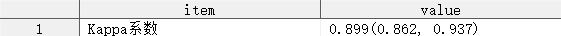
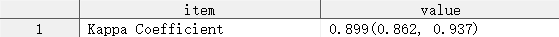
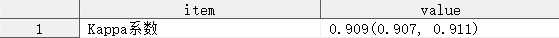
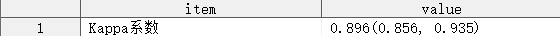
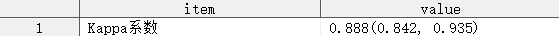
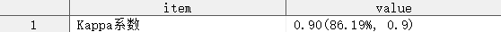
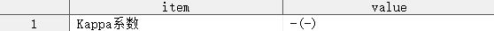

## 简介

Kappa 系数及其置信区间的计算。

## 语法

### 必选参数

- [INDATA](#indata)
- [TABLE_DEF](#table_def)
- [OUTDATA](#outdata)

### 可选参数

- [STAT_NOTE](#stat_note)
- [WEIGHT](#weight)
- [KAPPA_TYPE](#kappa_type)
- [KAPPA_WEIGHT](#kappa_weight)
- [ALPHA](#alpha)
- [FORMAT](#format)
- [PLACEHOLDER](#placeholder)

### 调试参数

- [DEL_TEMP_DATA](#del_temp_data)

## 参数说明

### INDATA

**Syntax** : <_libname._>_dataset_(_dataset-options_)

指定用于定性分析的数据集，可包含数据集选项

_libname_: 数据集所在的逻辑库名称

_dataset_: 数据集名称

_dataset-options_: 数据集选项，兼容 SAS 系统支持的所有数据集选项

**Usage** :

```sas
INDATA = ADSL
INDATA = SHKY.ADSL
INDATA = SHKY.ADSL(where = (FAS = "Y"))
```

[Example](#一般用法)

---

### TABLE_DEF

**Syntax** :

- _variable-1\*variable-2_
- _variable-1_("_level-1_"<, "_level-2_"<, ...>>)\*_variable-2_("_level-1_"<, "_level-2_"<, ...>>)

指定 $R\times C$ 表的定义，其中 _`variable-1`_ 表示 $R\times C$ 表的行变量，_`variable-2`_ 表示 $R\times C$ 表的列变量，_`level-i`_ 表示行（列）的具体分类名称。

> [!IMPORTANT]
>
> - 参数 `TABLE_DEF` 指定的 $R\times C$ 表的大小必须不小于 $2\times 2$ ；
> - 参数 `TABLE_DEF` 指定的行列变量的分类名称可以不完全相同，但由于 Kappa 系数的计算基于方形表，因此宏程序会试图求取行列变量中各分类的并集，然后在此基础上构建方形表。对于加权 Kappa 系数，行列变量的顺序有可能会影响最终的计算结果，为了避免歧义，在计算加权 Kappa 系数时，参数 `TABLE_DEL` 应当显式指定行列变量的各分类名称，且行列变量应当指定相同的分类名称。例如：`TABLE_DEF = TSTP("阳性", "阴性", "无效")*TSTC("阳性", "阴性", "无效")`。

**Usage** :

```sas
TABLE_DEF = %str(TSTP*TSTC)
TABLE_DEF = %str(TSTP("阳性", "阴性", "无效")*TSTC("阳性", "阴性", "无效"))
```

[Example](#一般用法)

---

### OUTDATA

**Syntax** : <_libname._>_dataset_(_dataset-options_)

指定统计结果输出的数据集，可包含数据集选项，用法同参数 [INDATA](#indata)。

输出数据集有 2 个变量，具体如下：

| 变量名 | 含义                   |
| ------ | ---------------------- |
| ITEM   | 指标名称               |
| VALUE  | Kappa 系数及其置信区间 |

**Usage** :

```sas
OUTDATA = T1
```

[Example](#一般用法)

---

### STAT_NOTE

**Syntax** : "_string_" | '_string_'

指定 Kappa 系数的名称，指定的名称将输出至参数 `OUTDATA` 指定的数据集中的 ITEM 列。

> [!IMPORTANT]
>
> 如果指定的 `STAT_NOTE` 中含有不匹配的引号，例如，需要指定 `STAT_NOTE` 为一个单引号，可以选择以下传参方式：
>
> ```sas
> STAT_NOTE = "'"
> ```
>
> 但不能使用以下传参方式：
>
> ```sas
> STAT_NOTE = ''''
> ```

**Default** : "kappa 系数"

**Usage** :

```sas
STAT_NOTE = %str(Kappa Coefficient)
```

[Example](#一般用法)

---

### WEIGHT

**Syntax** : _variable_

指定计算频数的权重变量。

**Default** : #NULL

默认情况下，数据集中的每一条观测的权重均为 1。

**Usage** :

```sas
WEIGHT = FREQ
```

[Example](#指定权重变量)

---

### KAPPA_TYPE

**Syntax** : #_kappa_type_specification_

指定计算 Kappa 系数的类型，_`kappa_type_specification`_ 可以是以下 Kappa 系数类型之一：

| Kappa 系数类型 | 含义            |
| -------------- | --------------- |
| #SIMPLE        | 简单 Kappa 系数 |
| #WEIGHTED      | 加权 Kappa 系数 |

**Default** : #SIMPLE

默认情况下，宏程序将计算简单 Kappa 系数。

**Usage** :

```sas
KAPPA_TYPE = #WEIGHTED
```

[Example](#指定计算-kappa-系数的类型)

---

### KAPPA_WEIGHT

**Syntax** : #_kappa_weight_keyword_

指定计算加权 Kappa 系数使用的权重类型，_`kappa_weight_keyword`_ 可以是以下权重类型之一：

| 权重类型          | 简写 |
| ----------------- | ---- |
| CICCHETTI-ALLISON | CA   |
| FLEISS-COHEN      | FC   |

**Default** : #AUTO

默认情况下，当参数 `KAPPA_TYPE` 指定了计算加权 Kappa 系数时，参数 `KAPPA_WEIGHT` 的默认值为 `CA`，表示使用 Cicchetti-Allison 权重进行计算。

> [!WARNING]
>
> - 参数 `KAPPA_TYPE` 未指定计算加权 Kappa 系数时，参数 `KAPPA_WEIGHT` 的值将被忽略；

**Usage** :

```sas
KAPPA_WEIGHT = FC
```

[Example](#指定计算加权-kappa-系数时使用的权重类型)

---

### ALPHA

**Syntax** : _numeric_

指定显著性水平，该参数将决定计算的置信区间的宽度，当指定参数 `ALPHA = α` 时，将计算 `1 - α` 置信区间。

**Default** : 0.05

默认情况下，宏程序将计算 95% 置信区间。

> [!WARNING]
>
> - 参数 `ALPHA` 只能指定 0 和 1 之间的数值；
> - 参数 `ALPHA` 指定的数值太小时，SAS 系统将发出警告，并用 0.000000011 代替参数 `ALPHA` 的值；
> - 参数 `ALPHA` 指定的数值太大时，SAS 系统将发出警告，并用 0.999999989 代替参数 `ALPHA` 的值；

**Usage** :

```sas
ALPHA = 0.10
```

[Example](#指定显著性水平)

---

### FORMAT

**Syntax** : _format-specification_

指定统计量的输出格式，_`format-specification`_ 的语法如下：

- _`format`_
- _`#statistic-keyword = format`_
- _`#statistic-keyword = format <#statistic-keyword = format <...>>`_

_`statistic-keyword`_ 可以是下述统计量之一：

| 统计量 | 含义         |
| ------ | ------------ |
| KAPPA  | Kappa 系数   |
| CLM    | 置信限       |
| LCLM   | 置信区间下限 |
| UCLM   | 置信区间上限 |

**Default** : 6.3

默认情况下，Kappa 系数及其置信区间的输出格式均为 `6.3`。

> [!IMPORTANT]
>
> - 若参数 `FORMAT` 仅指定了一个输出格式，但未指定某个统计量，则所有统计量的输出格式均会受影响，例如：`FORMAT = 4.1`，则 Kappa 系数、置信区间上限、置信区间下限的输出格式均被指定为 `4.1`；
> - 若参数 `FORMAT` 指定了统计量 `CLM` 的输出格式，则置信区间上限和置信区间下限的输出格式会同时受到影响，例如：`FORMAT = %str(#CLM = 4.1)`，则置信区间上限和置信区间下限的输出格式均被指定为 `4.1`，而 Kappa 系数的输出格式仍然保持默认值 `6.3`；
> - 若参数 `FORMAT` 多次指定了相同统计量的输出格式，则最后一次指定的输出格式才会生效，例如：`FORMAT = %str(#KAPPA = 5.2 #KAPPA = 6.3 #KAPPA = 7.4)`，则最终生效的输出格式为 `7.4`；
> - 若参数 `FORMAT` 多次指定了会相互影响的统计量的输出格式，则被影响的部分统计量将按照最后一次指定的输出格式输出，未受影响的部分统计量的输出格式保持不变，例如：`FORMAT = %str(#CLM = 4.1 #LCLM = percentn9.2)`，则置信区间上限的输出格式为 `4.1`，置信区间下限的输出格式为 `percentn9.2`。

**Usage** :

```sas
FORMAT = %str(#KAPPA = 5.2 #CLM = percentn9.2)
```

[Example](#指定统计量输出格式)

---

### PLACEHOLDER

**Syntax** : "_string_" | '_string_'

指定当无法计算 Kappa 系数及其置信区间时，输出数据集中显示的字符（串）。

> [!IMPORTANT]
>
> 如果指定的 `PLACEHOLDER` 中含有不匹配的引号，例如，需要指定 `PLACEHOLDER` 为一个单引号，可以选择以下传参方式：
>
> ```sas
> PLACEHOLDER = "'"
> ```
>
> 但不能使用以下传参方式：
>
> ```sas
> PLACEHOLDER = ''''
> ```

**Default** : `"-"`

**Usage** :

```sas
PLACEHOLDER = %str(不适用)
```

[Example](#指定无法计算-kappa-系数及置信区间时显示的字符串)

---

### DEL_TEMP_DATA

**Syntax** : TRUE | FALSE

指定是否删除中间数据集。默认情况下，宏程序将删除运行过程中生成的所有中间数据集。

**Default** : TRUE

## 例子

### 打开帮助文档

```sas
%KappaCI();
%KappaCI(help);
```

### 一般用法

```sas
%KappaCI(indata = adeff(where = (CMPTFL = "Y")),
         table_def = TSTP("阳性", "阴性", "无效")*TSTC("阳性", "阴性", "无效"),
         outdata = t1);
```



### 指定统计量名称

```sas
%KappaCI(indata = adeff(where = (CMPTFL = "Y")),
         table_def = TSTP("阳性", "阴性", "无效")*TSTC("阳性", "阴性", "无效"),
         outdata = t1,
         stat_note = "Kappa Coefficient");
```



### 指定权重变量

```sas
data adeff;
    set temp.adeff;
    freq = _n_;
run;

%KappaCI(indata = adeff(where = (CMPTFL = "Y")),
         table_def = TSTP("阳性", "阴性", "无效")*TSTC("阳性", "阴性", "无效"),
         outdata = t1,
         weight = freq);
```



### 指定计算 Kappa 系数的类型

```sas
%KappaCI(indata = adeff(where = (CMPTFL = "Y")),
         table_def = TSTP("阳性", "阴性", "无效")*TSTC("阳性", "阴性", "无效"),
         outdata = t1,
         kappa_type = #weighted);
```



### 指定计算加权 Kappa 系数时使用的权重类型

```sas
%KappaCI(indata = adeff(where = (CMPTFL = "Y")),
         table_def = TSTP("阳性", "阴性", "无效")*TSTC("阳性", "阴性", "无效"),
         outdata = t1,
         kappa_type = #weighted,
         kappa_weight = fleiss-cohen);
```



### 指定显著性水平

```sas
%KappaCI(indata = adeff(where = (CMPTFL = "Y")),
         table_def = TSTP("阳性", "阴性", "无效")*TSTC("阳性", "阴性", "无效"),
         outdata = t1,
         kappa_type = #weighted,
         kappa_weight = fleiss-cohen,
         alpha = 0.1);
```

### 指定统计量输出格式

```sas
%KappaCI(indata = adeff(where = (CMPTFL = "Y")),
         table_def = TSTP("阳性", "阴性", "无效")*TSTC("阳性", "阴性", "无效"),
         outdata = t1,
         format = %str(#kappa = 5.2 #clm = 4.1 #lclm = percentn9.2));
```



### 指定无法计算 Kappa 系数及置信区间时显示的字符（串）

```sas
%KappaCI(indata = adeff(where = (CMPTFL = "Y")),
         table_def = TSTP("金", "木", "水", "火", "土")*TSTC("甲", "乙", "丙", "丁", "戊"),
         outdata = t1,
         format = %str(5.2),
         placeholder = "-");
```


