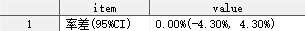
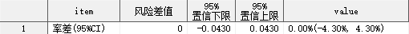
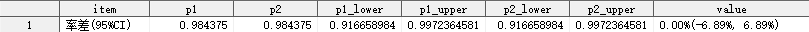
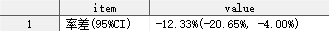
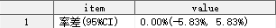
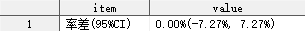
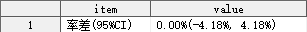
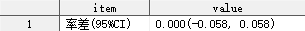

## 简介

计算两组率差及其置信区间。

## 语法

### 必选参数

- [INDATA](#indata)
- [GROUP](#group)
- [RESPONSE](#response)
- [STAT_NOTE](#stat_note)
- [OUTDATA](#outdata)

### 可选参数

- [WEIGHT](#weight)
- [METHOD](#method)
- [ALPHA](#alpha)
- [FORMAT](#format)

### 调试参数

- [DEL_TEMP_DATA](#del_temp_data)

## 参数说明

### INDATA

**Syntax** : <_libname._>_dataset_(_dataset-options_)

指定用于定性分析的数据集，可包含数据集选项

_libname_: 数据集所在的逻辑库名称

_dataset_: 数据集名称

_dataset-options_: 数据集选项，兼容 SAS 系统支持的所有数据集选项

**Usage** :

```sas
- INDATA = ADSL
- INDATA = ADAM.ADSL
- INDATA = ADAM.ADSL(where = (FAS = "Y"))
```

---

### GROUP

**Syntax** : _variable_("_treatment-level_" - "_control-level_")

指定组别变量，同时指定组别变量用于计算率差的两个水平名称，_treatment-level_ 和 _control-level_ 的顺序决定了率差计算结果的正负性。

- _treatment-level_ : 通常代表试验组；
- _control-level_ : 通常代表对照组；

**Usage** :

```sas
GROUP = arm("试验组" - "对照组")
```

> [!WARNING]
>
> - 参数 GROUP 不允许指定参数 INDATA 数据集中不存在的变量
> - 参数 GROUP 不允许指定数值型变量

---

### RESPONSE

**Syntax** : _variable_("_positive-level_")

指定响应变量，同时指定响应变量用于计算率差的水平名称。

- _positive-level_ : 通常代表感兴趣的结局；

**Usage** :

```sas
RESPONSE = cmyn("是")
```

> [!WARNING]
>
> - 参数 RESPONSE 不允许指定参数 INDATA 数据集中不存在的变量
> - 参数 RESPONSE 不允许指定数值型变量

---

### STAT_NOTE

**Syntax** : "_string_" | '_string_'

指定计算的率差及其置信区间的展示名称。

`STAT_NOTE` 指定的展示名称将输出至参数 `OUTDATA` 指定的数据集中。

> [!CAUTION]
>
> 如果指定的 `STAT_NOTE` 中含有不匹配的引号，例如，需要指定 `STAT_NOTE` 为一个单引号，可以选择以下传参方式：
>
> ```sas
> LABEL = "'"
> ```
>
> 但不能使用以下传参方式：
>
> ```sas
> LABEL = ''''
> ```

**Usage** :

```sas
STAT_NOTE = '手术成功率差值(95%CI)'
```

---

### OUTDATA

**Syntax** : <_libname._>_dataset_(_dataset-options_)

指定统计结果输出的数据集，可包含数据集选项，用法同参数 [INDATA](#indata)。

当参数 [GROUP](#group) 和 [RESPONSE](#response) 都已经确定时，宏程序将构建 $2 \times 2$ 的四格表并尝试计算第一行第一列与第二行第一列的率差及其置信区间。

|                   |                  |                  |          |
| ----------------- | ---------------- | ---------------- | -------- |
|                   | _positive-level_ | _negative-level_ | 合计     |
| _treatment-level_ | $n_{11}$         | $n_{12}$         | $n_{10}$ |
| _control-level_   | $n_{21}$         | $n_{22}$         | $n_{20}$ |
| 合计              | $n_{01}$         | $n_{02}$         | $n_{00}$ |

- $p_1 = n_{11}/n_{10}$
- $p_2 = n_{21}/n_{20}$
- $p_{diff} = p_1 - p_2$

输出数据集的变量及其含义具体如下：

| 变量名         | 含义                       |
| -------------- | -------------------------- |
| ITEM           | 统计量名称                 |
| RISKDIFFERENCE | $p_{diff}$                 |
| LOWERCL        | $p_{diff}$ 的置信区间下限  |
| UPPERCL        | $p_{diff}$ 的置信区间上限  |
| VALUE          | 率差及其置信区间的格式化值 |

若指定 `METHOD = NEWCOMBE<CORRECT>`，则还会额外输出以下变量：

| 变量名      | 含义                                                                     |
| ----------- | ------------------------------------------------------------------------ |
| N11         | _treatment-level_ & _positive-level_ 的频数                              |
| N12         | _treatment-level_ & _negative-level_ 的频数                              |
| N10         | _treatment-level_ 的频数                                                 |
| N21         | _control-level_ & _positive-level_ 的频数                                |
| N22         | _control-level_ & _negative-level_ 的频数                                |
| N20         | _control-level_ 的频数                                                   |
| ALPHA       | 显著性水平 $\alpha$                                                      |
| P1          | $p_1$                                                                    |
| P2          | $p_2$                                                                    |
| PDIFF       | $p_{diff}$                                                               |
| Z           | 标准正态分布下 $1 - \alpha / 2$ 的分位数                                 |
| DELTA1      | 使用 Newcombe-Wilson 方法计算 $p_1$ 置信限时，一元二次方程的 $\Delta$ 值 |
| DELTA1      | 使用 Newcombe-Wilson 方法计算 $p_2$ 置信限时，一元二次方程的 $\Delta$ 值 |
| P1_LOWER    | $p_1$ 的置信区间下限                                                     |
| P1_UPPER    | $p_1$ 的置信区间上限                                                     |
| P2_LOWER    | $p_2$ 的置信区间下限                                                     |
| P2_UPPER    | $p_2$ 的置信区间上限                                                     |
| PDIFF_LOWER | $p_{diff}$ 的置信区间下限                                                |
| PDIFF_UPPER | $p_{diff}$ 的置信区间上限                                                |

其中，变量 `ITEM` 和 `VALUE` 默认输出到 `OUTDATA` 指定的数据集中，其余变量默认隐藏。

> [!Tip]
>
> - 如需显示隐藏的变量，可使用数据集选项实现，例如：`OUTDATA = T1(KEEP = ITEM P1 P2 VALUE)`

**Usage** :

```sas
OUTDATA = T1
OUTDATA = T1(KEEP = ITEM P1 P2 VALUE)
```

---

### WEIGHT

**Syntax** : _variable_

指定计算频数的权重变量。

**Default** : #NULL

默认情况下，数据集中的每一条观测的权重均为 1。

> [!WARNING]
>
> - 参数 `WEIGHT` 不允许指定为参数 `INDATA` 指定的数据集中不存在的变量；
> - 参数 `WEIGHT` 不允许指定为字符型变量

**Usage** :

```sas
WEIGHT = FREQ
```

---

### METHOD

**Syntax** : _method-specification_<(_sub-options_)>

指定计算率差置信区间使用的统计方法，受支持的 _`method-specification`_ 及对应 _`sub-options`_ 如下表所示：

| 统计方法     | 简写 | 子选项                |
| ------------ | ---- | --------------------- |
| AGRESTICOULL | AC   |                       |
| EXACT        |      |                       |
| HA           |      |                       |
| MN           |      | CORRECT = NO<br />MEE |
| SCORE        |      | CORRECT = NO<br />MEE |
| NEWCOMBE     |      | CORRECT               |
| WALD         |      | CORRECT               |

**Default** : WALD

> [!IMPORTANT]
>
> - 当四格表存在某行或某列频数之和为零时，请指定参数 `METHOD = NEWCOMBE` 或 `METHOD = NEWCOMBE(CORRECT)`，否则计算无法进行

> [!CAUTION]
>
> - 建议仅在 $\alpha <= 0.1$ 时指定参数 `METHOD = NEWCOMBE(CORRECT)`，因为在某些特定情况下，Newcombe-Wilson 方法在计算两组率各自的置信区间时，可能会出现一元二次方程判别式小于零的情况，此时方程无实数解，导致后续无法对置信限进行杂交。具体细节如下：
>
>   Newcombe-Wilson 计算率差置信区间的思路：先使用 Wilson 方法计算两组率各自的置信区间，之后对两组率的置信限进行杂交获得率差置信区间。
>
>   - 在不校正的情况下，Wilson 方法计算单组率置信限的公式如下：
>
>     $$L,U = \frac{2np + z^2 \pm \sqrt{z^2 + 4np(1-p)}}{2(n + z^2)}$$
>
>     判别式 $\Delta = z^2 + 4np(1-p) \ge 0$ 恒成立。[WolframeAlpha 验证结果](https://www.wolframalpha.com/input?i=Solve%5B%7Bz%5E2%2B4*p*%28%281-p%29*n%29%3C0%2C+0%3C%3Dp%3C%3D1%2C+n%3E%3D1%7D%2C+n%5D)
>
>   - 在校正的情况下，Wilson 方法计算单组率置信限的公式如下：
>
>     $$L = \frac{2np + z^2 - 1 - z\sqrt{z^2 - 2 - \frac{1}{n} + 4p(n - np + 1)}}{2(n + z^2)}$$
>
>     $$U = \frac{2np + z^2 + 1 + z\sqrt{z^2 + 2 - \frac{1}{n} + 4p(n - np - 1)}}{2(n + z^2)}$$
>
>     - 下限的判别式 $\Delta_L = z^2 - 2 - \frac{1}{n} + 4p(n - np + 1)$ 符号不确定。[WolframeAlpha 验证结果](https://www.wolframalpha.com/input?i=Solve%5B%7Bz%5E2+-+2+-+1%2Fn+%2B4*p*%28n+-+n*p+%2B+1%29%3C0%2C+0%3C%3Dp%3C%3D1%2C+n%3E%3D1%7D%2C+n%5D)
>
>     - 上限的判别式 $\Delta_U = z^2 + 2 - \frac{1}{n} + 4p(n - np - 1)$ 符号不确定。[WolframeAlpha 验证结果](https://www.wolframalpha.com/input?i=Solve%5B%7Bz%5E2+%2B+2+-+1%2Fn+%2B4*p*%28n+-+n*p+-+1%29%3C0%2C+0%3C%3Dp%3C%3D1%2C+n%3E%3D1%7D%2C+n%5D)
>
>     - $\alpha <= 0.1$ ，即 $|z| >= 1.645$ 时， $\Delta_L >= 0$ 恒成立。[WolframeAlpha 验证结果](https://www.wolframalpha.com/input?i=Solve%5B%7Bz%5E2+-+2+-+1%2Fn+%2B4*p*%28n+-+n*p+%2B+1%29%3C0%2C+0%3C%3Dp%3C%3D1%2C+n%3E%3D2%2C+abs%28z%29%3E%3D1.645%7D%2C+n%5D)
>
>     - $\alpha <= 0.1$ ，即 $|z| >= 1.645$ 时， $\Delta_U >= 0$ 恒成立。[WolframeAlpha 验证结果](https://www.wolframalpha.com/input?i=Solve%5B%7Bz%5E2+%2B+2+-+1%2Fn+%2B4*p*%28n+-+n*p+-+1%29%3C0%2C+0%3C%3Dp%3C%3D1%2C+n%3E%3D2%2C+abs%28z%29%3E%3D1.645%7D%2C+n%5D)

**Usage** :

```sas
METHOD = NEWCOMBE(CORRECT)
```

---

### ALPHA

**Syntax** : _numeric_

指定显著性水平，该参数将决定计算的置信区间的宽度，当指定参数 `ALPHA = α` 时，将计算 `1 - α` 置信区间。

**Default** : 0.05

默认情况下，宏程序将计算 95% 置信区间。

> [!WARNING]
>
> - 参数 `ALPHA` 只能指定 0 和 1 之间的数值；
> - 参数 `ALPHA` 指定的数值太小时，SAS 系统将发出警告，并用 0.000000011 代替参数 `ALPHA` 的值；
> - 参数 `ALPHA` 指定的数值太大时，SAS 系统将发出警告，并用 0.999999989 代替参数 `ALPHA` 的值；

**Usage** :

```sas
ALPHA = 0.10
```

---

### FORMAT

**Syntax** : _format_

指定统计量的输出格式。

**Default** : PERCENTN9.2

默认情况下，率差及其置信区间的输出格式均为 `PERCENTN9.2`。

**Example** :

```sas
FORMAT = srate.
```

---

### DEL_TEMP_DATA

**Syntax** : TRUE | FALSE

指定是否删除中间数据集。

**Default** : TRUE

默认情况下，宏程序将删除运行过程中生成的所有中间数据集。

## 例子

### 打开帮助文档

```sas
%RiskDiff()
%RiskDiff(help)
```

### 一般用法

```sas
%RiskDiff(indata = analysis,
          group = arm("试验组" - "对照组"),
          response = nyha("是"),
          stat_note = '率差(95%CI)',
          outdata = s1);
```



### 指定需要保留的变量

```sas
%RiskDiff(indata = analysis,
          group = arm("试验组" - "对照组"),
          response = nyha("是"),
          stat_note = '率差(95%CI)',
          outdata = s1(keep = _all_));
```



```sas
%RiskDiff(indata = analysis,
          group = arm("试验组" - "对照组"),
          response = nyha("是"),
          stat_note = '率差(95%CI)',
          outdata = s1(keep = item value p1 p2 p1_lower p1_upper p2_lower p2_upper value),
          method = newcombe);
```



### 指定权重变量

```sas
data analysis;
    length arm $200 nyha $200;
    if _n_ = 1 then do;
        arm = "试验组"; armn = 1; nyha = "是"; nyhan = 1; freq = 1; output;
        arm = "试验组"; armn = 1; nyha = "否"; nyhan = 2; freq = 10; output;
        arm = "对照组"; armn = 2; nyha = "是"; nyhan = 1; freq = 10; output;
        arm = "对照组"; armn = 2; nyha = "否"; nyhan = 2; freq = 1; output;
    end;
    set adam.adsl; freq = 1; if not missing(arm); output;
run;

%RiskDiff(indata = analysis,
          group = arm("试验组" - "对照组"),
          response = nyha("是"),
          stat_note = '率差(95%CI)',
          outdata = s1,
          weight = freq);
```



### 指定计算率差置信区间的方法

```sas
%RiskDiff(indata = analysis,
          group = arm("试验组" - "对照组"),
          response = nyha("是"),
          stat_note = '率差(95%CI)',
          outdata = s1,
          method = newcombe);
```



```sas
%RiskDiff(indata = analysis,
          group = arm("试验组" - "对照组"),
          response = nyha("是"),
          stat_note = '率差(95%CI)',
          outdata = s1,
          method = newcombe(correct));
```



### 指定显著性水平

```sas
%RiskDiff(indata = analysis,
          group = arm("试验组" - "对照组"),
          response = nyha("是"),
          stat_note = '率差(95%CI)',
          outdata = s1,
          method = newcombe,
          alpha = 0.10);
```



### 指定统计量输出格式

```sas
%RiskDiff(indata = analysis,
          group = arm("试验组" - "对照组"),
          response = nyha("是"),
          stat_note = '率差(95%CI)',
          outdata = s1,
          method = newcombe,
          format = 8.3);
```


